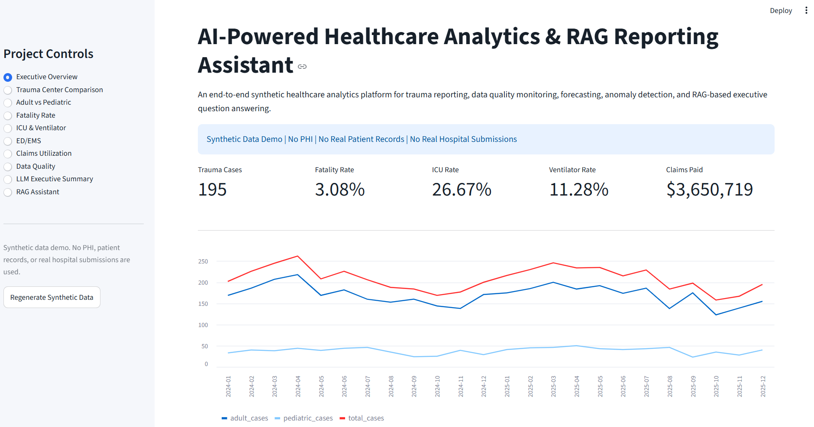
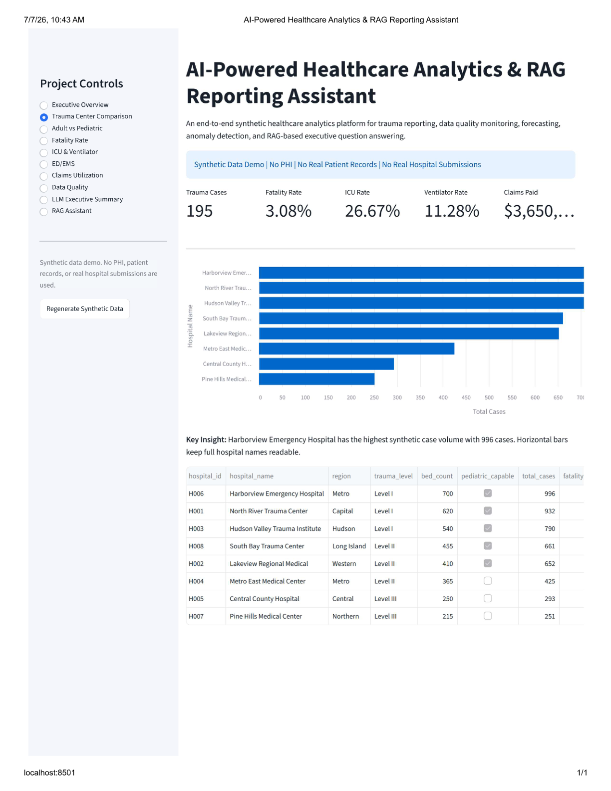
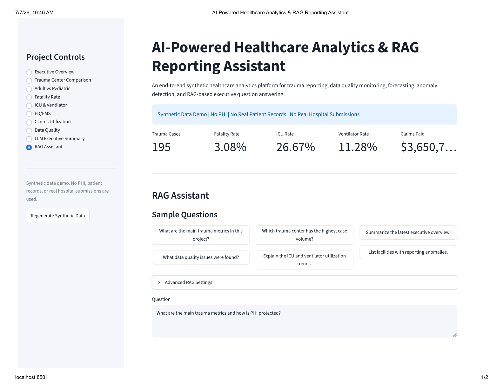
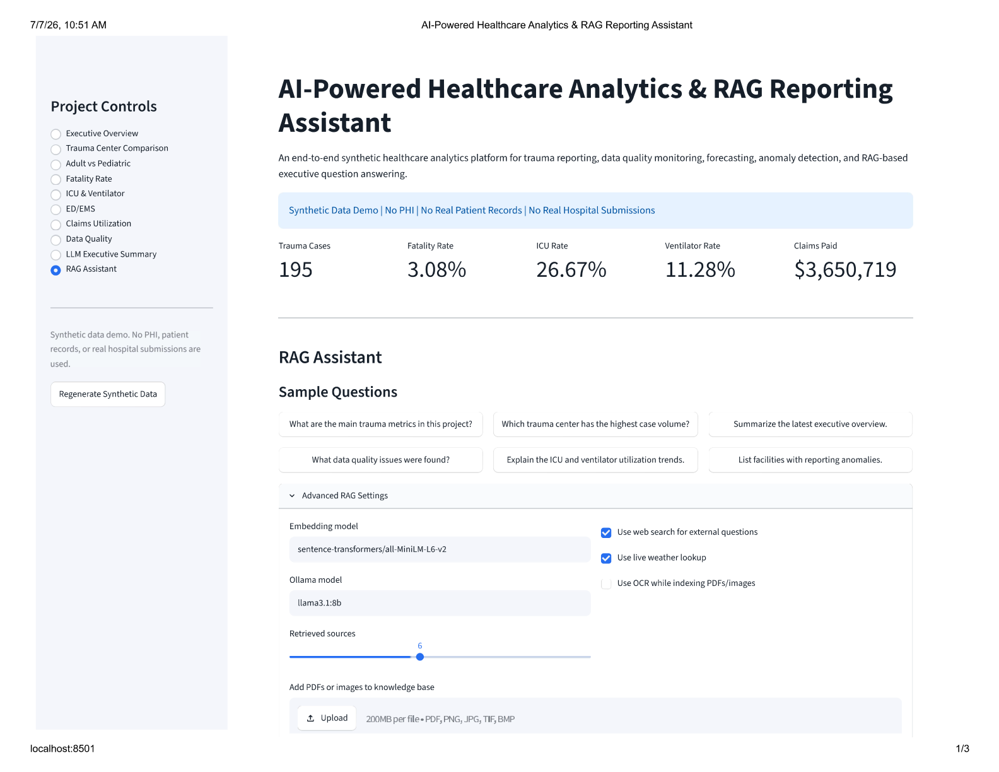
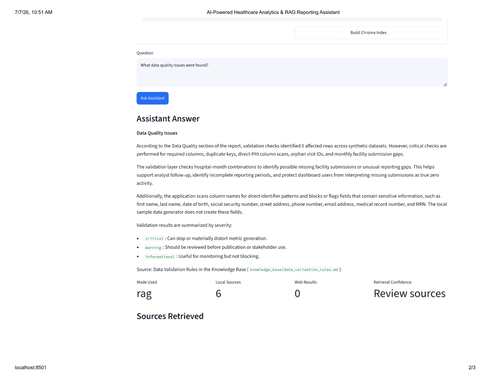
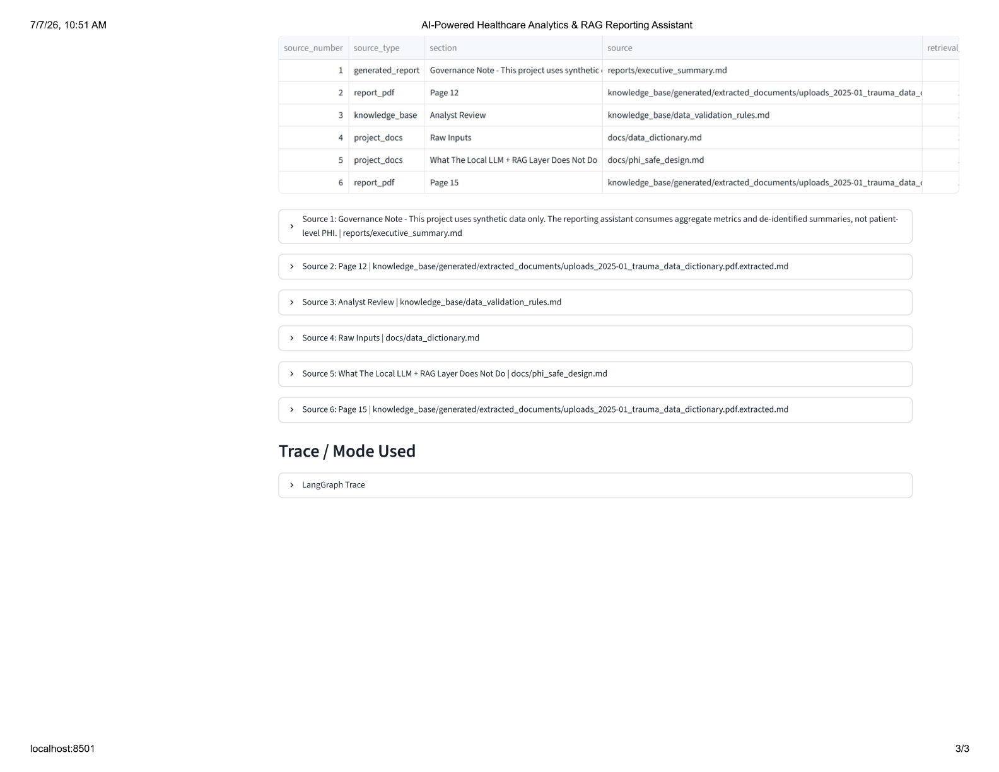
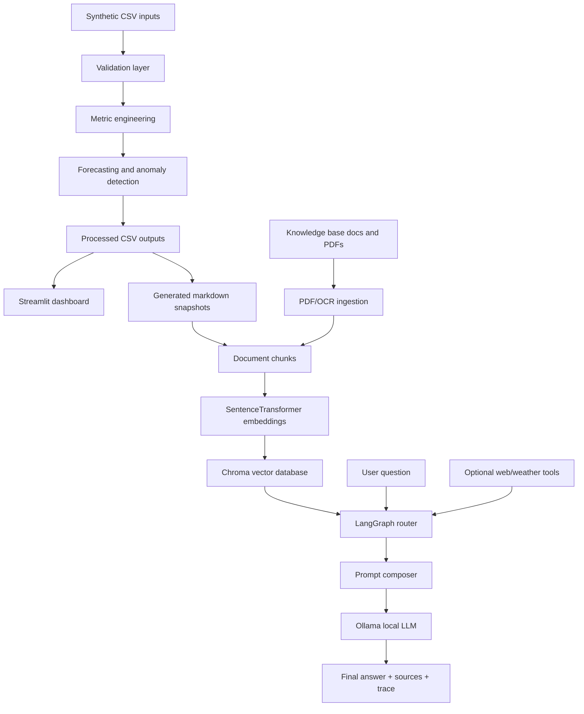
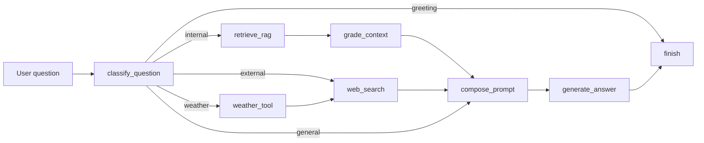

# AI-Powered Healthcare Analytics & RAG Reporting Assistant


An end-to-end synthetic healthcare analytics platform that generates trauma reporting data, validates data quality, builds dashboard-ready metrics, performs forecasting/anomaly detection, and enables natural-language question answering using RAG, Chroma, LangGraph, and Ollama.

This project uses 100% synthetic data. It does not contain real patient data, PHI, employer data, hospital submissions, claims data, or confidential records.

## Dashboard Preview

### Executive Overview Dashboard



### Dashboard Detail View



### RAG Assistant View



### Additional Analytics Views







## Business Problem

Healthcare reporting teams need trusted aggregate data before they can publish dashboards, review care patterns, or answer leadership questions. Raw submissions often require validation, transformation, anomaly review, forecasting, and documentation support.

This project recreates that workflow in a safe local environment using synthetic trauma reporting data. It combines traditional analytics with a local LLM assistant that can explain dashboard metrics, retrieve supporting documents, summarize reports, and route external questions away from the internal knowledge base.

## Solution Overview

The project includes:

- Synthetic trauma data generation.
- Data validation and quality checks.
- Dashboard-ready KPI and facility comparison tables.
- Rolling anomaly detection for unusual facility-month reporting changes.
- Forecasting and model comparison for trauma case volume.
- PDF/OCR document ingestion.
- Chroma vector database indexing with SentenceTransformer embeddings.
- LangGraph routing for internal RAG, general LLM, web, and weather questions.
- Ollama-based local LLM responses without an API key.
- Streamlit dashboard for analytics and RAG question answering.

## Architecture Diagram

```text
Synthetic Data Generator
        |
        v
Data Validation Layer
        |
        v
Metric Engineering
        |
        v
Forecasting + Anomaly Detection
        |
        v
Executive Reports + CSV Outputs
        |
        v
Knowledge Base / Markdown Snapshots
        |
        v
SentenceTransformer Embeddings
        |
        v
Chroma Vector DB
        |
        v
LangGraph Routing
        |
        v
Ollama / Local LLM Assistant
```



## Tech Stack

| Layer | Tools |
|---|---|
| Language | Python |
| Data processing | pandas, numpy |
| Dashboard | Streamlit, Altair |
| Modeling | moving average baseline, linear trend, random forest benchmark |
| RAG | SentenceTransformers, Chroma |
| Agent routing | LangGraph |
| Local LLM | Ollama, default `llama3.1:8b` |
| Document ingestion | PyMuPDF, Pillow, pytesseract OCR |
| External tools | DuckDuckGo search, Open-Meteo weather |
| Packaging | pyproject.toml, requirements.txt, Dockerfile |

## Data Flow

1. Generate synthetic trauma, EMS, transfer, claims, hospital, and population data.
2. Validate schema, keys, required fields, numeric ranges, orphan records, and facility-month submission patterns.
3. Build aggregate dashboard metrics in `data/processed/`.
4. Run anomaly detection and case-volume forecasting.
5. Write executive markdown summaries in `reports/`.
6. Convert dashboard metrics and document extracts into knowledge-base markdown.
7. Build a Chroma index using SentenceTransformer embeddings.
8. Route user questions through LangGraph.
9. Use Ollama to generate a clear final answer with sources and trace details.

## Features

- Executive KPI dashboard for trauma cases, fatality rate, ICU rate, ventilator rate, and claims paid.
- Trauma center comparison with readable horizontal bar chart.
- Adult vs pediatric case distribution.
- Cleaner fatality trend view with selected hospital and all-hospital average.
- ICU and ventilator utilization trends.
- ED/EMS timing and claims utilization views.
- Data quality summary and reporting anomaly review.
- LLM-generated executive narrative.
- RAG assistant with sample questions, advanced settings, source display, retrieval confidence, and LangGraph trace.
- PDF and OCR ingestion for adding reports to the local knowledge base.
- RAG evaluation runner with keyword coverage, retrieved-source checks, groundedness score, retrieval score, and pass/fail output.

## Folder Structure

```text
.
|-- app/
|   `-- streamlit_app.py
|-- data/
|   |-- raw/
|   `-- processed/
|-- docs/
|   |-- screenshots/
|   |-- architecture.md
|   |-- deployment.md
|   `-- workflow.md
|-- knowledge_base/
|   |-- generated/
|   |-- uploads/
|   `-- *.md
|-- prompts/
|   `-- assistant_system_prompt.md
|-- reports/
|-- src/
|   `-- healthcare_analytics/
|       |-- agent_graph.py
|       |-- data_generator.py
|       |-- document_ingestion.py
|       |-- local_llm.py
|       |-- metrics.py
|       |-- modeling.py
|       |-- pipeline.py
|       |-- rag.py
|       |-- rag_evaluation.py
|       |-- validation.py
|       |-- weather_tool.py
|       `-- web_search.py
|-- tests/
|-- vector_store/
|-- Dockerfile
|-- pyproject.toml
|-- requirements.txt
`-- README.md
```

## How to Run

Open PowerShell or Terminal in the project folder:

```powershell
cd ai-powered-healthcare-analytics-rag-reporting-assistant
```

Create and activate a virtual environment:

```powershell
python -m venv .venv
Set-ExecutionPolicy -ExecutionPolicy Bypass -Scope Process
.\.venv\Scripts\Activate.ps1
```

Install dependencies:

```powershell
pip install --upgrade pip
pip install -r requirements.txt
pip install -e .
```

Install and start Ollama separately, then pull the local model:

```powershell
ollama pull llama3.1:8b
```

Generate data, reports, and the RAG index:

```powershell
python -m healthcare_analytics.pipeline --records 5000 --months 24 --seed 42 --build-rag-index --rag-ocr
```

Run the dashboard:

```powershell
streamlit run app/streamlit_app.py
```

Streamlit will print a local URL, usually:

```text
http://localhost:8501
```

## RAG Assistant Demo Questions

Try these in the Streamlit RAG Assistant page:

- What are the main trauma metrics in this project?
- Which trauma center has the highest case volume?
- Summarize the latest executive overview.
- What data quality issues were found?
- Explain the ICU and ventilator utilization trends.
- List facilities with reporting anomalies.
- Give a summary of the audit report for each facility.
- How does the LangGraph workflow decide whether to use RAG or web search?

## Command Line Examples

Ask a project question:

```powershell
python -m healthcare_analytics.rag ask "What are the main trauma metrics?"
```

Rebuild only the Chroma index after adding documents:

```powershell
python -m healthcare_analytics.rag build --ocr
```

Run the RAG evaluation:

```powershell
python -m healthcare_analytics.rag_evaluation --output reports/rag_evaluation.json
```

## Sample Outputs

| Output | Purpose |
|---|---|
| `data/processed/executive_overview.csv` | Monthly KPI summary |
| `data/processed/hospital_comparison.csv` | Facility comparison metrics |
| `data/processed/facility_monthly_submissions.csv` | Hospital-month reporting table |
| `data/processed/reporting_anomalies.csv` | Rolling anomaly flags |
| `data/processed/case_volume_forecast.csv` | Forecasted case volume |
| `data/processed/forecast_model_comparison.csv` | MAE/RMSE/MAPE model comparison |
| `data/processed/data_quality_summary.csv` | Validation summary |
| `reports/executive_summary.md` | Generated executive narrative |
| `reports/facility_narratives.md` | Facility-level summaries |
| `reports/rag_evaluation.json` | RAG evaluation results |

## RAG And Agent Workflow

The assistant classifies each user question before choosing tools:



Routing behavior:

- Internal dashboard, trauma, validation, PDF, Chroma, and LangGraph questions use Chroma RAG.
- External/current/public questions skip Chroma and use web search when enabled.
- Weather questions use the weather tool first.
- General chatbot questions use the LLM without local retrieval.
- The app displays the final answer, local sources, web evidence, retrieval confidence, and LangGraph trace.

## Forecasting And Model Comparison

The forecasting layer compares:

- Previous-month baseline.
- Three-month moving average.
- Linear trend with seasonal anchor.
- Random forest benchmark when `scikit-learn` is installed.

The transparent trend model remains the default reporting model because it is easier to explain in operational analytics settings.

## Data Privacy Note

This project is designed for local analytics development with synthetic data only.

- No real patient records.
- No PHI.
- No real hospital submissions.
- No confidential employer data.
- No real claims data.
- No API key required for the default local LLM path.

## Deployment

### Local Demo

Use Streamlit locally:

```powershell
streamlit run app/streamlit_app.py
```

This starts a local Streamlit server. Ollama must also be running locally for the full RAG assistant experience.

### Docker

```powershell
docker build -t ai-powered-healthcare-rag .
docker run -p 8501:8501 `
  -e HEALTHCARE_OLLAMA_BASE_URL="http://host.docker.internal:11434" `
  -e HEALTHCARE_LLM_MODEL="llama3.1:8b" `
  ai-powered-healthcare-rag
```

### Streamlit Cloud

The dashboard can be deployed to Streamlit Cloud from GitHub. The analytics pages work with the generated CSV files in the repository.

For public RAG access, the app needs a reachable LLM endpoint. The default Ollama setup is best for local use. For cloud hosting, use one of these paths:

- Run Ollama on a reachable private server and set `HEALTHCARE_OLLAMA_BASE_URL`.
- Add a managed LLM provider through Streamlit secrets, such as an OpenAI-compatible API key, while keeping Ollama as the local default.
- Disable public RAG access and use the cloud app for dashboard viewing only.

Never commit API keys, private endpoints, or confidential data to GitHub.


## Future Improvements

- Add a managed cloud LLM provider option for public deployments.
- Add authentication for a public dashboard.
- Add more RAG evaluation questions and expected-answer checks.
- Add downloadable PDF reports from the dashboard.
- Add automated screenshot generation for release documentation.
- Add CI workflow for tests, linting, and dependency checks.
