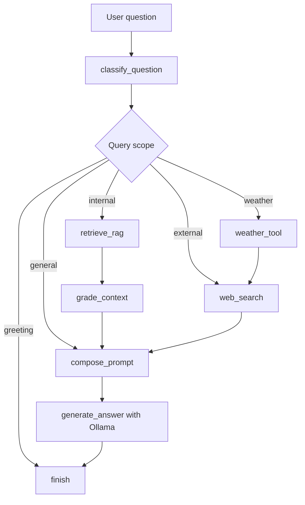

# Agent Workflow

The assistant uses a LangGraph state workflow implemented in `src/healthcare_analytics/agent_graph.py`. The important rule is that the graph classifies the question before retrieval. Chroma is only used for internal project, dashboard, report, and trauma analytics questions.

## Query Scopes

| Scope | Routing Behavior |
|---|---|
| `internal` | Uses Chroma retrieval and local knowledge-base evidence. |
| `external` | Skips Chroma and uses web search snippets before the LLM response. |
| `weather` | Uses the Open-Meteo weather tool first; falls back to web/general answer if needed. |
| `general` | Skips Chroma and answers with the local LLM. |
| `greeting` | Returns a short greeting without retrieval. |

## Nodes

| Node | What It Does |
|---|---|
| `classify_question` | Uses a knowledge-base dictionary and question signals to classify the query scope. |
| `retrieve_rag` | Runs only for `internal` questions and retrieves Chroma chunks. |
| `grade_context` | Checks whether retrieved local context is useful enough to include. |
| `weather_tool` | Uses Open-Meteo for current weather questions without an API key. |
| `web_search` | Runs for `external` questions and weather fallback; it does not run local RAG. |
| `compose_prompt` | Combines only the evidence selected by the route. |
| `generate_answer` | Sends the final prompt to the Ollama model. |

## Source-Aware Retrieval

For internal questions, the retriever classifies local evidence before it is sent to the LLM:

| Source Type | Meaning |
|---|---|
| `report_structured` | Clean markdown references generated from PDF facility tables. |
| `report_pdf` | Extracted PDF/OCR report text. |
| `generated_dashboard` | Synthetic dashboard metric snapshots. |
| `generated_report` | Generated executive and facility narratives. |
| `project_docs` | Architecture, workflow, deployment, and data dictionary documentation. |
| `knowledge_base` | Manually written project knowledge documents. |

For audit-report, submitted-case, hospital-list, and facility-list questions, the retriever prefers `report_structured` and `report_pdf` evidence. External questions bypass all of these sources.

## Modes

| Mode | Meaning |
|---|---|
| `greeting` | Lightweight response for simple greetings. |
| `general_llm` | Ollama answers without local RAG evidence. |
| `external_llm` | External question where web search was unavailable, so Ollama answers without local RAG. |
| `rag` | Local Chroma evidence is used. |
| `web` | Web snippets are used. |
| `weather` | Open-Meteo current weather evidence is used. |

The app shows the final answer first. Evidence and trace are shown separately so the routing path can be reviewed.
