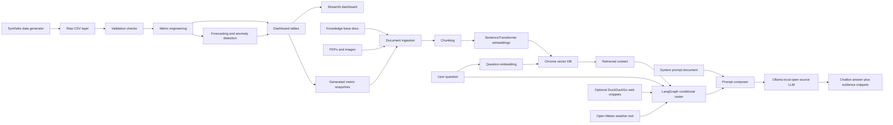

# Architecture

The project implements a public health trauma analytics workflow with non-identifiable sample data, PDF/OCR document ingestion, Chroma RAG, LangGraph tool routing, optional web search, and a local Ollama LLM.

## Main Components

| Component | Resource Name | Purpose |
|---|---|---|
| Synthetic data generator | `src/healthcare_analytics/data_generator.py` | Creates trauma registry, EMS, transfer, claims, hospital master, and population reference CSVs. |
| Validation layer | `src/healthcare_analytics/validation.py` | Runs missing value, duplicate key, data type, direct-PHI column, orphan visit ID, and facility submission checks. |
| Metric layer | `src/healthcare_analytics/metrics.py` | Builds dashboard-ready monthly, hospital, demographic, ICU, ventilator, ED/EMS, claims, and data quality outputs. |
| Modeling layer | `src/healthcare_analytics/modeling.py` | Adds transparent trend forecasting and rolling baseline anomaly detection. |
| Document ingestion layer | `src/healthcare_analytics/document_ingestion.py` | Extracts PDF text and optional OCR text into generated markdown for RAG. |
| Prompt layer | `prompts/assistant_system_prompt.md` | Defines answer style, RAG rules, web rules, privacy boundaries, and fallback behavior. |
| Local LLM layer | `src/healthcare_analytics/local_llm.py` | Calls an Ollama model such as `llama3.1:8b` without an API key. |
| LangGraph agent layer | `src/healthcare_analytics/agent_graph.py` | Defines graph state, nodes, conditional edges, tool routing, prompt composition, and answer generation. |
| RAG agent layer | `src/healthcare_analytics/rag.py` | Builds Chroma index, retrieves context, routes questions, creates agent prompts, calls Ollama, and returns answers. |
| Web search helper | `src/healthcare_analytics/web_search.py` | Adds optional DuckDuckGo snippets when users enable web search. |
| Dashboard | `app/streamlit_app.py` | Presents the project tabs listed in the handbook plan. |

## PHI Boundary

The synthetic generator intentionally excludes names, addresses, phone numbers, emails, Social Security numbers, dates of birth, and medical record numbers. The reporting assistant consumes aggregate outputs and metric summaries only.
