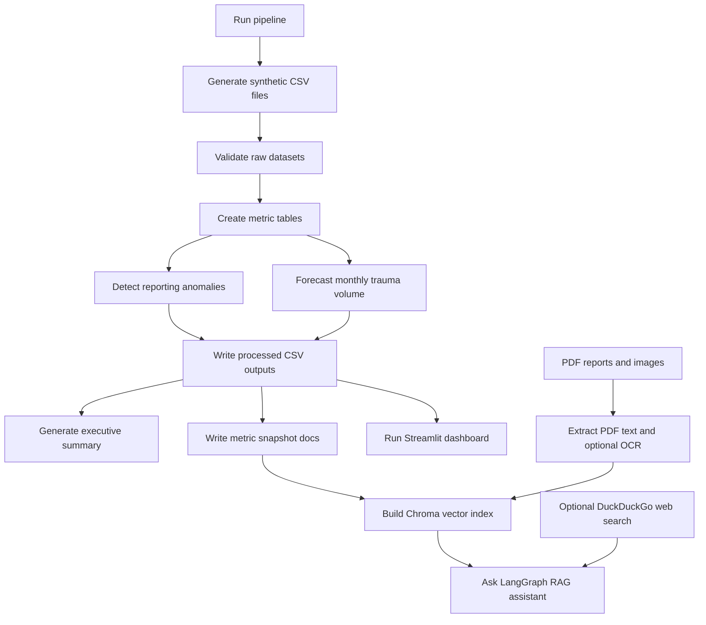

# Workflow

## Steps

1. Generate synthetic source files under `data/raw/`.
2. Validate schema, required fields, duplicate keys, direct-PHI column names, orphan records, nonnegative fields, and facility-month submissions.
3. Build aggregate metrics for executive overview, trauma center comparison, demographics, fatality, ICU, ventilator, ED/EMS, claims utilization, and data quality.
4. Apply transparent analytical methods:
   - Rolling z-score anomaly detection for unusual hospital-month submission changes.
   - Linear trend with seasonal anchor forecasting for future monthly case volume.
5. Save dashboard-ready CSV outputs under `data/processed/`.
6. Generate aggregate-only markdown narratives under `reports/`.
7. Write generated metric snapshots under `knowledge_base/generated/`.
8. Extract selectable PDF text and optional OCR text into `knowledge_base/generated/extracted_documents/`. Use `--rag-ocr` with the pipeline or `--ocr` with the RAG builder when OCR is needed.
9. Build the Chroma vector database from knowledge base docs, report docs, generated metric snapshots, PDF extracts, and OCR extracts.
10. Ask questions through the LangGraph conditional router agent.
11. Launch the Streamlit dashboard.
